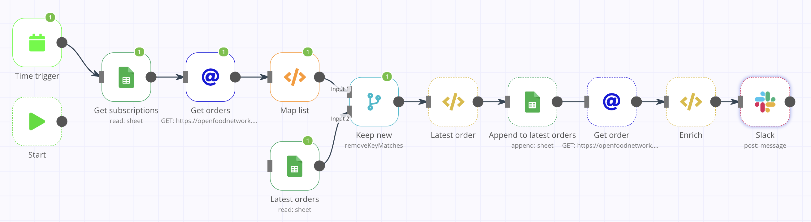
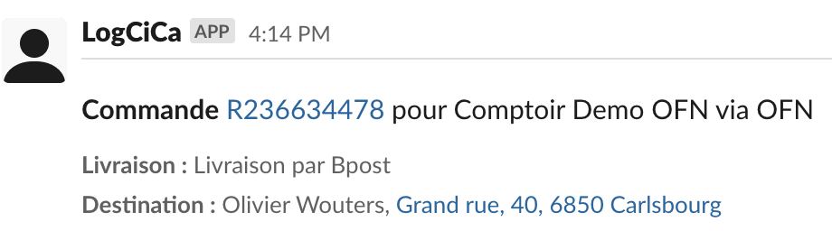

# Digicirco automation

n8n workflows for platform integration

## [Order to shipment (OFN to Logcica)](order_to_shipment_ofn_logcica.json) [demo]

Get new completed orders from OFN (for enterprise that want the integration) and notify about the completed order through slack message + shipping info. 

**Result :**

